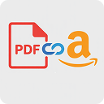

# PDF to Link for Amazon

  

  <b>Generate Amazon-compliant PDF links for your product manuals with just one click!</b>

[Website](https://pdf2link4amazon.aluo.app) • 
[How to Use](https://pdf2link4amazon.aluo.app/how-to-use.html) • 
[Report Issues](https://github.com/aluoapp/pdf-to-link-for-amazon/issues)

## ✨ Features

- 🚀 **One-click Upload**: Instantly upload PDFs and generate direct links
- 🚀 **Amazon Compliant**: Generate browser-accessible PDF links that meet Amazon's requirements
- 🛡️ **Secure Hosting**: Reliable file hosting with public access options
- 📋 **Easy Integration**: Simple copy-paste functionality for Amazon Seller Central
- ⚡ **Lightning Fast**: Quick and efficient link generation
- ☁️ **Cloud Support**: Compatible with Cloudflare R2 and Amazon S3

## 🎯 Perfect For

- Amazon FBA sellers
- Amazon FBM sellers
- Private label sellers
- Cross-border e-commerce businesses
- Anyone needing to provide product documentation on Amazon

## 🚀 Quick Start

1. Install the extension from [Chrome Web Store](https://chrome.google.com/webstore/detail/jhdphoenmohagfngdcgplchppljbjpnf)
2. Click the extension icon in your browser
3. Upload your PDF file
4. Copy the generated link
5. Paste the link in your Amazon Seller Central

## 💡 Why Choose PDF to Link for Amazon?

- ⏱️ **Save Time**: Eliminate manual steps in your documentation workflow
- ✅ **Stay Compliant**: Meet Amazon's electronic manual submission policy
- 🌍 **Global Ready**: Perfect for international sellers
- ⭐ **Enhance Listings**: Improve your product listing quality

## 🔧 Technical Details

- Built with modern web technologies
- Secure file handling
- Cross-browser compatibility
- Regular updates to meet Amazon's latest requirements

## 🤝 Contributing

We welcome contributions! Please see our [Contributing Guidelines](CONTRIBUTING.md) for details.

## 📝 License

This project is licensed under the MIT License - see the [LICENSE](LICENSE) file for details.

## 📞 Support & Contact

- 🌐 [Website](https://pdf2link4amazon.aluo.app)
- 📖 [Documentation](https://pdf2link4amazon.aluo.app/how-to-use.html)
- 🐛 [Report Issues](https://github.com/aluoapp/pdf-to-link-for-amazon/issues)
- 📧 Email: aluoapps@gmail.com

---

  Built with ❤️ for Amazon sellers worldwide

